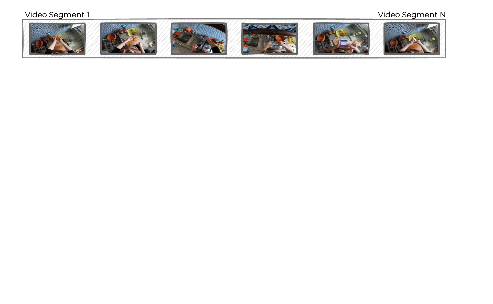

<div align="center">


# HiERO: understanding the hierarchy of human behavior enhances reasoning on egocentric videos

[Simone Alberto Peirone](https://scholar.google.com/citations?user=K0efPssAAAAJ) • [Francesca Pistilli](https://scholar.google.com/citations?user=7MJdvzYAAAAJ) • [Giuseppe Averta](https://scholar.google.com/citations?user=i4rm0tYAAAAJ)

</div>

<div align="center">
<a href='https://arxiv.org/abs/2505.12911' style="margin: 10px"></a>
<a href='https://sapeirone.github.io/HiERO/' style="margin: 10px"></a>
</div>

<br>

<div align="center">
Welcome to the official repository of our paper "<i>HiERO: understanding the hierarchy of human behavior enhances reasoning on egocentric videos</i>", <b>accepted at ICCV 2025</b>.
</div>

<br>

<div align="center">
<figure>

</figure>
</div>


## 📝 Abstract

Human activities are particularly complex and variable, and this makes challenging for deep learning models to reason about them. However, we note that such variability does have an underlying structure, composed of a hierarchy of patterns of related actions. We argue that such structure can emerge naturally from unscripted videos of human activities, and can be leveraged to better reason about their content. We present HiERO, a weakly-supervised method to enrich video segments features with the corresponding hierarchical activity threads. By aligning video clips with their narrated descriptions, HiERO infers contextual, semantic and temporal reasoning with an hierarchical architecture. We prove the potential of our enriched features with multiple video-text alignment benchmarks (EgoMCQ, EgoNLQ) with minimal additional training, and in zero-shot for procedure learning tasks (EgoProceL and Ego4D Goal-Step). Notably, HiERO achieves state-of-the-art performance in all the benchmarks, and for procedure learning tasks it outperforms fully-supervised methods by a large margin (+12.5% F1 on EgoProceL) in zero shot. Our results prove the relevance of using knowledge of the hierarchy of human activities for multiple reasoning tasks in egocentric vision.


## 🔎 Getting started

### 🏗️ Environment and data setup

First, clone the current repository and create the required directories:
```
git clone --recursive git@github.com:sapeirone/HiERO.git && cd HiERO
mkdir -p checkpoints data/ego4d/raw/annotations data/ego4d/raw/features
```

Then, build a python environment and install all the required dependencies:
```
python -m venv .env
source .env/bin/activate
pip install -r requirements.txt -f https://data.pyg.org/whl/torch-2.4.0+cu124.html --extra-index-url https://download.pytorch.org/whl/
```

Finally, download the Ego4d annotations and the pre-extracted features and copy (or link them) in the `data/ego4d/raw` directory.
Download and copy the [EgoClip](https://drive.google.com/file/d/1-aaDu_Gi-Y2sQI_2rsI2D1zvQBJnHpXl/view?usp=sharing) and [EgoMCQ](https://drive.google.com/file/d/1-5iRYf4BCHmj4MYQYFRMY4bhsWJUN3rW/view?usp=sharing) annotations from [EgoVLP](https://github.com/showlab/EgoVLP) in the `data/ego4d/raw/annotations` directory.

The resulting `data/ego4d/raw` should be structured as follows:
```
data/ego4d/raw
          └─── annotations
          │    ├─── v1
          │    │    │ ego4d.json
          │    │    │ ...
          │    ├──── egoclip.csv
          │    └──── egomcq.json
          │
          └─── features
               ├─── omnivore_video_swinl
               │    │ 64b355f3-ef49-4990-8622-9e9eef68b495.pth
               │    │ ...
               │     
               └─── egovlp
                    │ 64b355f3-ef49-4990-8622-9e9eef68b495.pth
                    │ ...
```

#### Pretrained components
For HiERO (EgoVLP), we use the frozen text encoder from EgoVLP. Download ([egovlp_text.pth](https://www.sapeirone.it/data/hiero/pretrained/egovlp_text.pth), [egovlp_txt_proj.pth](https://www.sapeirone.it/data/hiero/pretrained/egovlp_txt_proj.pth)) and copy the weights under the pretrained directory:
```
pretrained
     ├─── egovlp_text.pth
     └─── egovlp_txt_proj.pth
```


## 🚀 Training and validation

### EgoClip/EgoMCQ
Training and validation on EgoClip/EgoMCQ are implemented in the `train.py` and `validate.py`. Pre-trained checkpoints are provided in section [Model Zoo](#-model-zoo).

**Training on EgoClip:**
```sh
python train.py --config-name=omnivore save_to=path/to/ckpt/dir
```

**Validation on EgoMCQ:**
```sh
python validate.py --config-name=omnivore resume_from=path/to/ckpt/dir/model.pth
```

### EgoProceL

Please refer to [egoprocel/README.md](egoprocel/README.md).

### Ego4d Goal-Step

Please refer to [ego4d_goalstep/README.md](ego4d_goalstep/README.md).


## 🐘 Model Zoo

> [!TIP]
> HiERO is backbone-agnostic and can be easily extended to new features extractors. See [here](features-extraction/README.md) for more!

We provide pretrained checkpoints of HiERO for a set of features extractors.
Omnivore Video Swin-L features are part of the official Ego4d release and can be downloaded following to the [official docs](https://ego4d-data.org/docs/CLI/). We provide pre-extracted features for the remaining backbones according to the following table.

| Backbone      | Config file   | Features    | Checkpoint | EgoMCQ Inter (\%) | EgoMCQ Intra (\%) |
|---------------|------------------------|----------------------|------------|-------------------|-------------------|
| **Omnivore**  | `omnivore`    | [ego4d docs](https://ego4d-data.org/docs/data/features/) | [hiero_omnivore.pth](https://www.sapeirone.it/data/hiero/ckpt/hiero_omnivore.pth)    | 90.1              | 53.4              |
| **EgoVLP**    | `egovlp`      | [ego4d_egovlp.zip](https://www.sapeirone.it/data/ego4d_features/ego4d_egovlp.zip) | [hiero_egovlp.pth](https://www.sapeirone.it/data/hiero/ckpt/hiero_egovlp.pth)    | 91.6              | 59.6              |
| **LaViLa**    | `lavila`      | [ego4d_LaViLa-L.zip](https://www.sapeirone.it/data/ego4d_features/ego4d_LaViLa-L.zip) | [hiero_lavila-l.pth](https://www.sapeirone.it/data/hiero/ckpt/hiero_lavila-l.pth)    | 94.6              | 64.4              |

## Acknowledgements
This study was carried out within the FAIR - Future Artificial Intelligence Research and received funding from the European Union Next-GenerationEU (PIANO NAZIONALE DI RIPRESA E RESILIENZA (PNRR) – MISSIONE 4 COMPONENTE 2, INVESTIMENTO 1.3 – D.D. 1555 11/10/2022, PE00000013). This manuscript reflects only the authors’ views and opinions, neither the European Union nor the European Commission can be considered responsible for them. We acknowledge the CINECA award under the ISCRA initiative, for the availability of high performance computing resources and support.

This codebase is based on our previous works [EgoPack](https://github.com/sapeirone/egopack) and [Hier-EgoPack](https://github.com/sapeirone/hier-egopack).


## Cite Us

```BibTeX
@article{peirone2025hiero,
  title={HiERO: understanding the hierarchy of human behavior enhances reasoning on egocentric videos},
  author={Peirone, Simone Alberto and Pistilli, Francesca and Averta, Giuseppe},
  journal={arXiv preprint arXiv:2505.12911},
  year={2025}
}
```